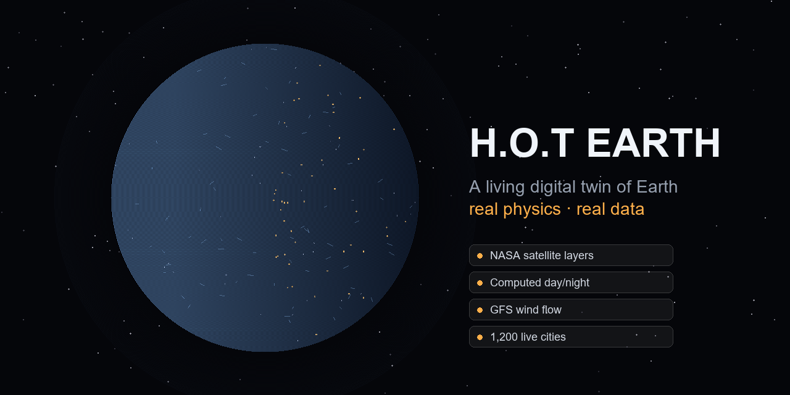

<div align="center">

# H.O.T Earth

### A living digital twin of Earth — real physics, real data, no fake numbers.

An interactive 3D globe with daily NASA satellite imagery, a physically-computed day/night terminator you can scrub through time, animated global wind from the latest GFS analysis, click-anywhere forecasts, and a "Living Earth" layer where 1,200 real cities light up along the actual terminator.

[**▶ Live demo**](https://hot-earth.vercel.app) &nbsp;·&nbsp; [Data sources](docs/DATA_SOURCES.md) &nbsp;·&nbsp; [Architecture](docs/ARCHITECTURE.md) &nbsp;·&nbsp; [Model card](model/output/MODEL_CARD.md) &nbsp;·&nbsp; [Contributing](CONTRIBUTING.md)



<sub>Phase 1 of 3 · Earth → Mars → Moon · MIT licensed · no API keys required</sub>

<sub>⚠️ The image above is a placeholder title card — grab the real globe screenshot in 2 minutes via [docs/media/README.md](docs/media/README.md).</sub>

</div>

---

## What makes this different

Most "3D earth" projects are a spinning texture with decorative numbers. This one is wired to real data and real physics end to end, and it is honest about the line between the two:

- **The terminator is computed, not drawn.** `lib/solar.ts` implements the NOAA solar-position algorithm (solar declination + equation of time → subsolar point), unit-tested against known solstice/equinox values. Scrub the time control and day/night moves exactly as the real sun does.
- **The wind is real.** The animated flow is the latest NOAA/NCEP GFS 10 m analysis, refreshed 4×/day, advected by bilinear interpolation of the actual grid (antimeridian wrap included, unit-tested). Only the playback speed is exaggerated so motion is visible at globe scale — the vectors are real.
- **The imagery is today's.** Daily NASA GIBS/Worldview satellite layers — true color, land-surface temperature, precipitation — proxied and cached, walking back a day when a layer hasn't published yet.
- **The forecast model reports honest, held-out accuracy.** A transparent baseline validated on a strict 2025 temporal holdout across 20 cities, with persistence as the reference. It **beats persistence by 9.6% / 15.2% / 17.8%** of MAE at 24/48/72 h — and the [model card](model/output/MODEL_CARD.md) states plainly that it is an educational baseline, **not** a rival to national weather services.
- **Anything simulated is labeled as simulated,** in the UI, right where it appears.
- **No API keys, anywhere.** Every data source is free and keyless. Clone, install, run.

## Features

| | |
|---|---|
| 🌍 **Interactive globe** | react-three-fiber sphere, orbit/zoom, starfield, sun-modulated atmosphere rim |
| 🛰️ **Live NASA layers** | true color · land-surface temp · precipitation · Blue Marble / Black Marble base |
| 🌗 **Physical day/night** | real subsolar point, twilight band to −12°, ±24 h time scrubber |
| 🌬️ **Global wind** | GFS 10 m analysis as GPU-friendly particle flow, refreshed every 6 h |
| 📍 **Click-anywhere forecast** | tap the globe → live 7-day Open-Meteo forecast for that exact point |
| 🏙️ **Living Earth tab** | 1,200 real cities glowing along the terminator; live per-city weather; a clearly-labeled activity simulation from local solar time + population |
| 📊 **Honest forecast baseline** | 20-city ridge model, validated on held-out 2025 data, browser-runnable |

## Quickstart

```bash
git clone https://github.com/Hotragn/H.O.T-EARTH.git
cd H.O.T-EARTH
npm install
npm run dev      # → http://localhost:3000
```

That's it — no `.env`, no keys, no accounts. Other commands:

```bash
npm run build                     # production build (deploys to Vercel with zero config)
npx vitest run                    # 41 unit tests: solar geometry, geo, wind interp, activity
python scripts/wind/fetch_wind.py # regenerate the wind field locally (needs requests + numpy)
```

## Forecast model — real numbers

Pooled over 20 cities, 2025 holdout, ~175k samples per lead. Skill = `1 − MAE_model / MAE_persistence`.

| Lead | Persistence MAE | Climatology MAE | **Ridge MAE** | Ridge skill |
|---|---|---|---|---|
| t+24 h | 1.87 °C | 2.47 °C | **1.69 °C** | **+9.6%** |
| t+48 h | 2.46 °C | 2.47 °C | **2.09 °C** | **+15.2%** |
| t+72 h | 2.73 °C | 2.47 °C | **2.25 °C** | **+17.8%** |

Easy climates score well (Lagos 0.59 °C at 24 h); hard continental ones don't (Denver 2.96 °C) — exactly as physics predicts. Full per-city results, limitations, and reproduction steps: [model card](model/output/MODEL_CARD.md).

## Architecture

The whole thing is built around one constraint: **Vercel hosts only the frontend and thin caching proxies — all heavy compute happens ahead of time, elsewhere.**

- **GitHub Actions cron** decodes GFS GRIB2 → compact JSON every 6 h (pure-Python decoder, no binary deps).
- **Offline Python** trains and validates the forecast model; the browser just runs the exported coefficients.
- **The browser** does solar geometry, particle advection, and model inference — all cheap.
- **Open-Meteo & NASA GIBS** are called directly (CORS, keyless); GIBS snapshots are cached through one Next.js route.

Full reasoning, including why not to run physics on Vercel and what we'd do if we ever needed live server compute: [docs/ARCHITECTURE.md](docs/ARCHITECTURE.md).

**Stack:** Next.js 15 (App Router) · TypeScript · Tailwind v4 · react-three-fiber + drei · three.js · Vitest.

## Data & licensing

Every dataset, its license, and how it's used is logged in [docs/DATA_SOURCES.md](docs/DATA_SOURCES.md) (verified against official sources). Summary: NASA GIBS (CC0), NOAA GFS & Natural Earth (US Gov public domain), Open-Meteo (CC-BY 4.0, attribution shown in-app). No source with unclear or restrictive terms is used.

## Roadmap

- [x] **Phase 1 — Earth.** Live globe, real data layers, physical terminator, wind, forecasts, Living Earth cities. *(this release)*
- [ ] **Phase 2 — Mars.** Real atmosphere and weather: dust-storm season, the seasonal CO₂ cycle, large diurnal swings, from mission data.
- [ ] **Phase 3 — Moon.** No atmosphere, so no fake weather — surface-temperature swings, illumination/day-night, and libration instead.

Contributions welcome — see [CONTRIBUTING.md](CONTRIBUTING.md). The honesty rule is non-negotiable: every number on screen traces to a data source or a documented calculation.

## License & attribution

Code: [MIT](LICENSE). Imagery courtesy NASA EOSDIS GIBS / Worldview and NASA Earth Observatory. Weather data by [Open-Meteo.com](https://open-meteo.com/) (CC-BY 4.0). Wind from NOAA/NCEP GFS (public domain). Cities from [Natural Earth](https://www.naturalearthdata.com/) (public domain). ERA5 via Open-Meteo — Copernicus Climate Change Service / ECMWF (DOI 10.24381/cds.adbb2d47). Not affiliated with or endorsed by NASA or NOAA.
